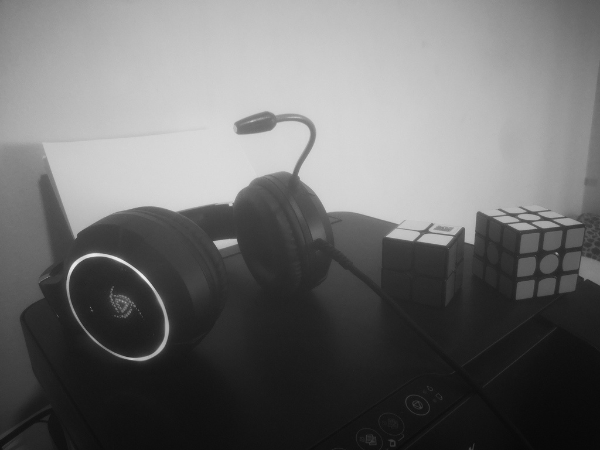

# Day 1

## 1. imgReadWrite

The most basic thing you can do in OpenCV and the start of many programs, reading and writing images to files, also learning how to read image directly in grayscale.

## 2. vidReadWrite

We learned how to read and write images, now time to learn how to read and write videos back to files.

## 3. rgbTesting

Here we learn about color spaces and creating plain color images using numpy arrays.

  
   
  
  

## 4. thresholding

Exploring the different methods for thresholding images like binary and trunc

  
  
   
  

## 5. colorDetection

Applying inRange function to detect specific colors based on its lower and upper HSV codes, this one is for masking blue color in video frames.

